# 重装系统和正版软件安装活动方案

#### XJTUANA, 4/19/2025

## 任务目标

1. 按照要求重装 / 重置目标计算机的 Microsoft Windows 操作系统，使其恢复出厂状态，并以最优的方式激活许可证。
2. 按照要求恢复目标计算机出厂预装的软件，并激活许可证。
3. 按照要求在目标计算机上安装正版软件平台提供的软件，并激活许可证。

> 注：不提供 Windows 10 / 11 以外的操作系统的安装。

## 活动组织

### 活动场地

TODO

### 物品清单

1. 硬件类

   1. U盘：[]个，安装 Ventoy，携带数据见软件类
   2. 笔记本电脑：[]个，用于临时下载未考虑到的软件
   3. USB Type-C 扩展坞：[]个，用于可能遇到的只有 USB Type-C 的笔记本电脑
   4. 鼠标：[]个，用于可能的 PE 环境下触控板不工作的设备
2. 软件类

   1. 系统安装类

      1. Ventoy：安装于U盘上，用于 iso 镜像启动
      2. Microsoft Windows 安装镜像：包含10，11的家庭和专业版
      3. 微 PE 工具箱镜像：用于执行可能的硬盘重新分区和 Microsoft Windows 安装
      4. 图吧工具箱：用于硬件检测（CrystalDiskInfo）
      5. Dism++：用于在 PE 环境以外备份驱动（微 PE 分发中包含Dism++）
      6. 正版软件管理与服务平台：用于激活 Microsoft Windows 的后备方案软件
      7. MAS：用于激活 Microsoft Windows 的最后手段
   2. 软件安装类

      1. Office Tool Plus：用于安装对应版本的 Microsoft Office
      2. 正版软件平台提供的 Microsoft Office 2024 安装镜像
      3. 福昕高级 PDF 编辑器 12 Windows 版
      4. Mathtype
      5. Matlab R2024b Windows

## 任务教程

### 任务流程

#### 1 评估

向机主确认 C 盘所有有价值内容都已备份，咨询机主的重装 / 重置 / 软件安装需求等，具体流程如下：

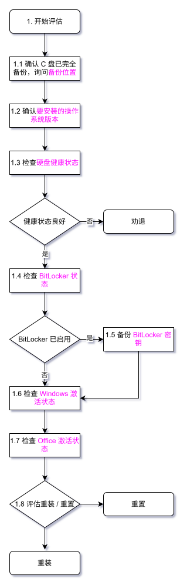

粉红色字体的内容是必须掌握的信息。

#### 2 重装

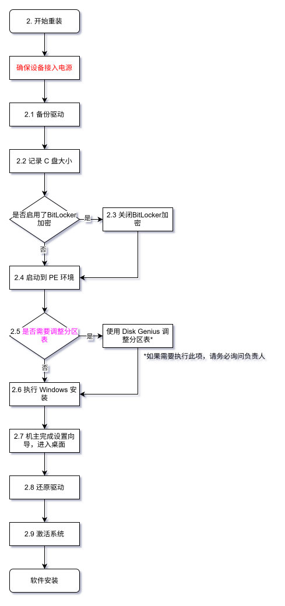

#### 3 重置

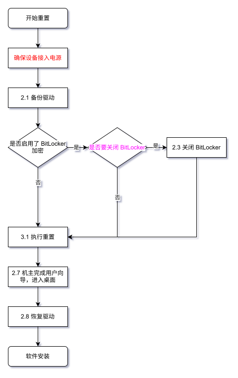

### 详细教程

#### 1 评估

##### 1.1 确认 C 盘已完全备份，询问备份位置

向机主确认，C 盘数据都已经备份，可以**全部清除**。

如果备份在外部介质，则可以对硬盘分区进行调整。如果备份与 C 盘在同一硬盘上（如备份在 D 盘，而且 C、D 盘在同一物理硬盘上），则后续不可调整分区结构。

##### 1.2 确认安装的 Windows 版本

向机主确认希望安装的 Windows 版本。

原则上安装 Windows 只安装原系统相同版本。如需更换版本，务必验证硬件兼容性（可询问 AI，处理器名称 + 操作系统版本是否兼容）。

如果是华为电脑，只能进行重置，不能重装，否则可能影响华为 share 与部分保修。

##### 1.3 检查硬盘健康状态

运行安装 U 盘中的 CrystalDiskInfo 检查系统硬盘状态
对于 SSD （转速一栏为SSD），检查 01、0E，确保原始值为 0。

对于机械硬盘，检查 C4、C5、C6。

如果其上任意值不为0且数值较高，**建议机主不要重装且尽快更换硬盘**。若坚持重装，请告知风险并确认该硬盘上所有分区的重要数据都备份到了**其他的硬件**上，以防止潜在可能的硬件损坏造成全盘数据丢失。

##### 1.4 检查 BitLocker 状态

浏览 “此电脑” 下的驱动器列表。已启用 BitLocker 加密的驱动器旁边通常会显示一个闭锁图标。然后查看驱动器属性，右键点击疑似被加密的驱动器，选择 “属性”。在属性窗口中，可以看到一个 “BitLocker” 选项卡，提供加密状态和管理选项。

记录 BitLocker 状态（启用 / 未启用），以便后续参考。

##### 1.5 备份 BitLocker 密钥

虽然理论上不会使用 BitLocker 密钥，但是为了以防万一，在此一定要对其进行备份。

点击 “开始”，输入 “BitLocker”，选择 “管理 BitLocker”。在 BitLocker 应用中，点击要备份的驱动器旁边的 “备份恢复密钥“，选 “保存到文件”，并选择保存密钥到 U 盘。

##### 1.6 检查 Windows 激活状态

进入设置检查激活状态：

* Windows 10：设置 - 更新和安全 - 激活
* Windows 11：设置 - 系统 - 激活 - 激活状态

如果为已激活并且是数字权利激活，后续优先安装相同级别的 Windows 版本以沿用原有许可证（即专业版 - 专业版，家庭版 -
家庭版）。

* 家庭中文版请重装家庭单语言版，但重装家庭版也行。
* 请与机主确认需求（沿用预装激活 / 升级到专业版）。
* Windows 10 / Windows 11 数字权利互通，可相互转换。

其他情况默认安装专业版使用学校正版平台激活。

* 必须半年一激活，要连接校园网
* 活动可能提供 1x 进行激活，如果使用了，务必记得忘记网络。

##### 1.7 检查 Office 激活状态

如果原系统安装有 Office，如果机主想要保留原有授权，请检查是否绑定了微软账户：

1. 记录 Office 版本，以便后续安装相同版本（使用 Office Tool Plus）。
   1. 打开 Office Tool Plus
   2. 进入“部署”标签页
   3. 下滑查看并记录“已安装的产品”
2. 打开任意 Office 应用。
3. 选择账户选项卡（老版本需要先打开或新建任意一个文件）。
4. 检查许可证与账户情况。
5. 如未登录微软账户，需要登陆微软账户绑定。
6. 保留原有家庭或学生版请使用微软官网安装器（或 Office Tool Plus）安装，否则无法激活。

##### 1.8 评估重装 / 重置

如果机主不需要变更系统版本 / 使用华为电脑，则优先进行**重置**。

如果机主需要变更系统版本 / 现有操作系统损坏，则进行重装。

#### 2 重装

##### 2.1 备份驱动

在原系统内，使用 Dism++ 备份原系统驱动程序，保存至 U 盘。

1. 打开 Dism++ 主面板，选择正确的 Windows 实例 （一般是 C:）。
   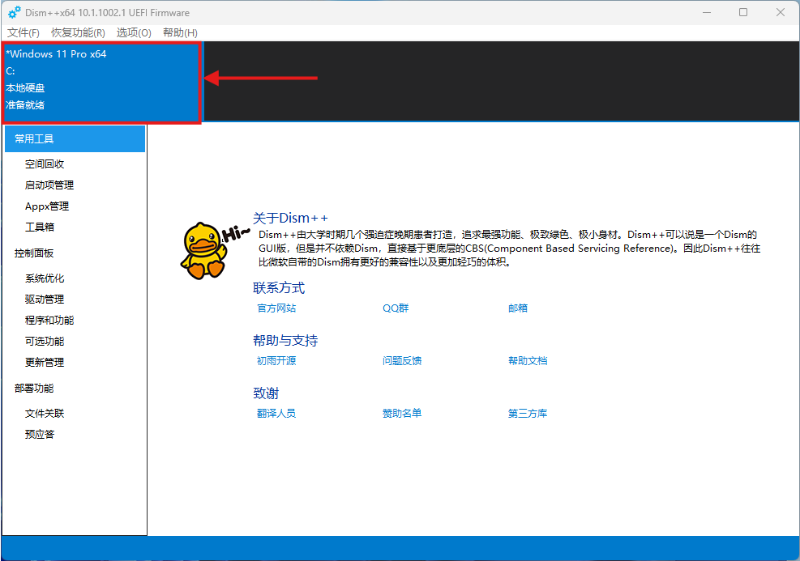
2. 选择驱动管理，点击全选，导出驱动。
   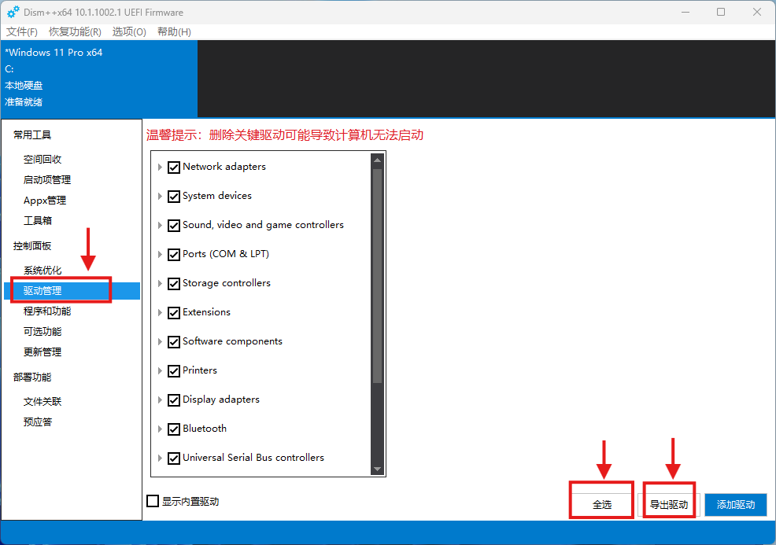
3. 在弹出对话框里定位到 U 盘路径，新建文件夹“驱动备份”，并选择该文件夹（注意，每台设备驱动不同，每次需采用不同的命名，建议命名为设备型号）。
   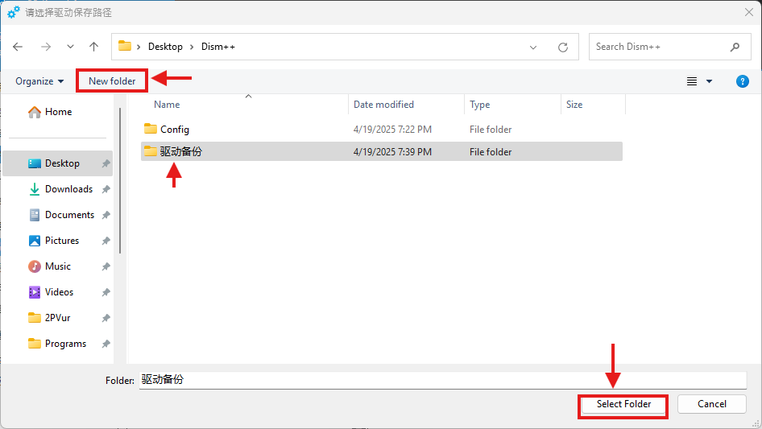
4. 等待驱动备份完成。

##### 2.2 记录 C 盘大小

如果有多个分区 / 硬盘，请记住 C 盘的大小，防止后续安装到错误的分区 / 硬盘上。

##### 2.3 关闭 BitLocker

重装系统需关闭 BitLocker， 否则重装后无法解密数据。

* Windows 10：进入设置 - 更新和安全 - 设备加密，点击关闭，然后等待解密即可。
* Windows 11：进入设置 - 隐私和安全性 - 设备加密，点击关闭，然后等待解密即可。

##### 2.4 启动到 PE 环境

在安装U盘插入电脑的情况下，关机，然后开机按对应按键进入引导设备设备选择。

* 有些轻薄本 F 键与媒体控制键复用，请确认调用F键是否需要按 Fn。
* 一般来说按键为 esc、f1、f2、f10、f12、delete 等。
* 一般来说惠普为 esc，联想为 f12，戴尔为 f2、f11。
* 可能是在 BIOS 中选择 Boot menu （惠普 / 联想拯救者），也有可能与 BIOS 不同按键直接进 Boot
  menu （联想小新 / yoga）
* 在boot menu中选择安装U盘为启动设备（一般为设备名或 USB Device）。
  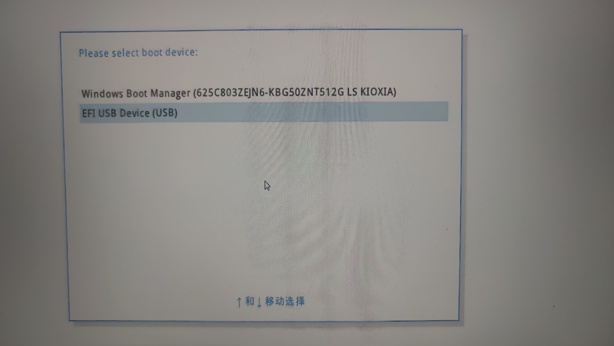
* 部分设备可能报告类似于“启动失败，设备中的操作系统未经验证”的错误；请进入 BIOS 设置 - Boot / 启
  动，将 Secure Boot / 安全启动设置为 off。**安装完系统后记得打开**。
* 如果使用 Ventoy，Ventoy 界面出现后，用键盘方向键选择，启动 WEPE.iso 或类似名称的项目。
* 进入 PE 界面。
  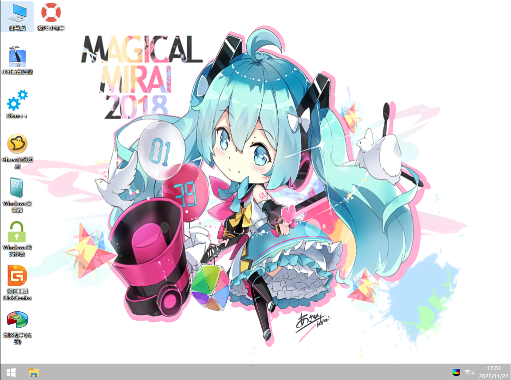

##### 2.5 是否需要调整分区表

如果机主希望更改分区大小 / 结构（比如 C 盘空间分一点给 D 盘），则需要调整分区表。注意，**只有机主的备份不在同一块硬盘上时才可以调整分区表，否则可能会造成数据丢失！**

如果需要执行分区表调整，请**务必**寻求负责人的帮助。

##### 2.6 执行 Windows 安装

1. 在 PE 中点击此电脑，打开 U 盘，在其中选择对应镜像双击打开。
   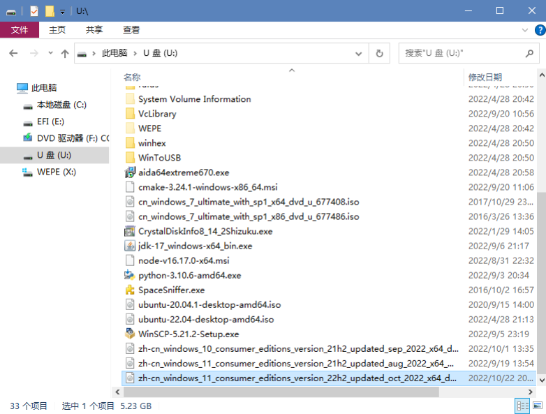
2. 运行 setup。
   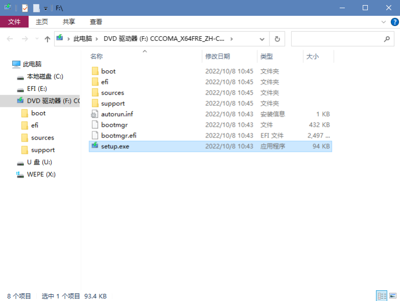
3. 点击现在安装 - 我没有产品密钥。
4. 选择对应版本。
   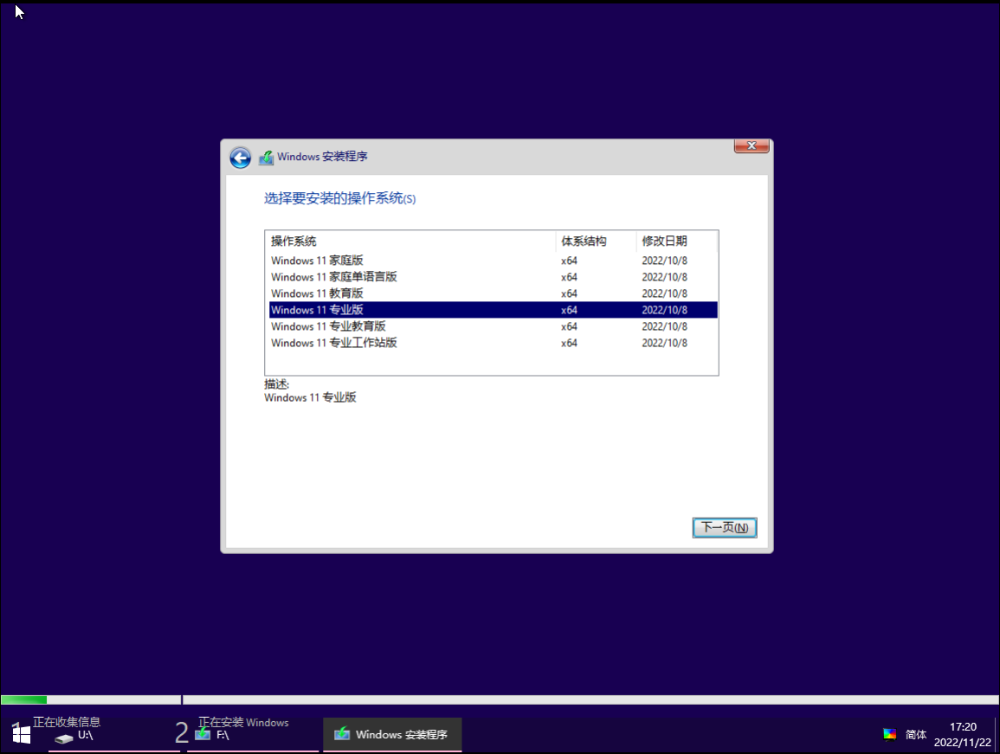
   注意，这里选择先前决策的版本。一般只会安装家庭版 / 专业版。
5. 同意条款，选择自定义安装。
   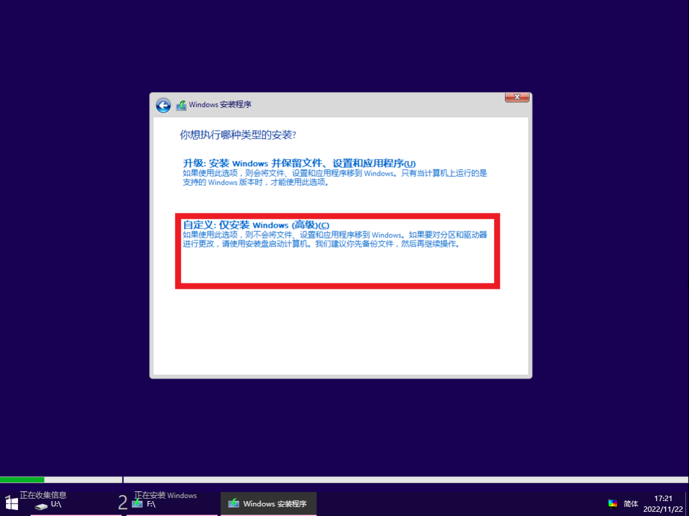
6. 找到 C 盘对应的标签，选中，点击格式化。

   * **此操作使该分区数据全部不可逆地被删除，谨慎操作。**
   * C 盘一般是对应驱动器的第三个分区。
   * 请与前期准备记下的C盘大小核对。
     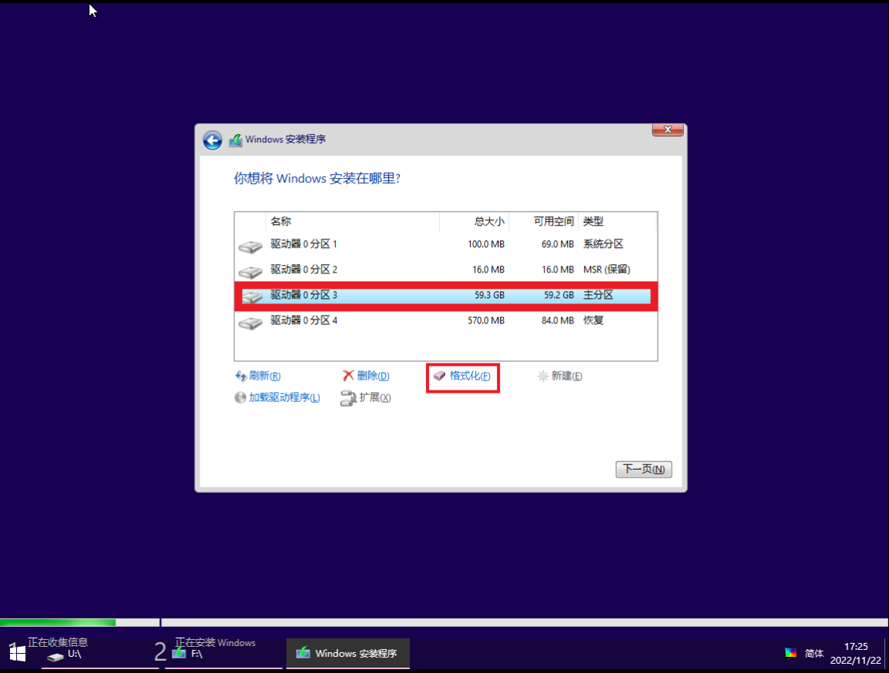
7. 格式化完点击下一页，即开始新系统的安装，安装完成后自动重启。

##### 2.7 机主完成设置向导

* 此时暂时不要连接网络，对 Windows 11 而言，可以用如下方法跳过联网：

  1. 到联网界面，按下 Shift + F10 快捷键（无效可试下 FN + Shfit + F10）
  2. 在出现的命令提示符页面输入 `OOBE\BYPASSNRO`，按回车键，等待电脑重启完成
  3. 重启后，在联网界面会有“我没有Internet连接”选项，点击此选项即可跳过联网
* 要求机主先不设置密码（即输入密码时留空，后续可由机主自行在设置内设置密码）。

##### 2.8 还原驱动

1. 进入桌面后，打开 Dism++ 主面板，选择驱动管理。
2. 点击添加驱动，选择之前备份的文件夹，等待驱动导入。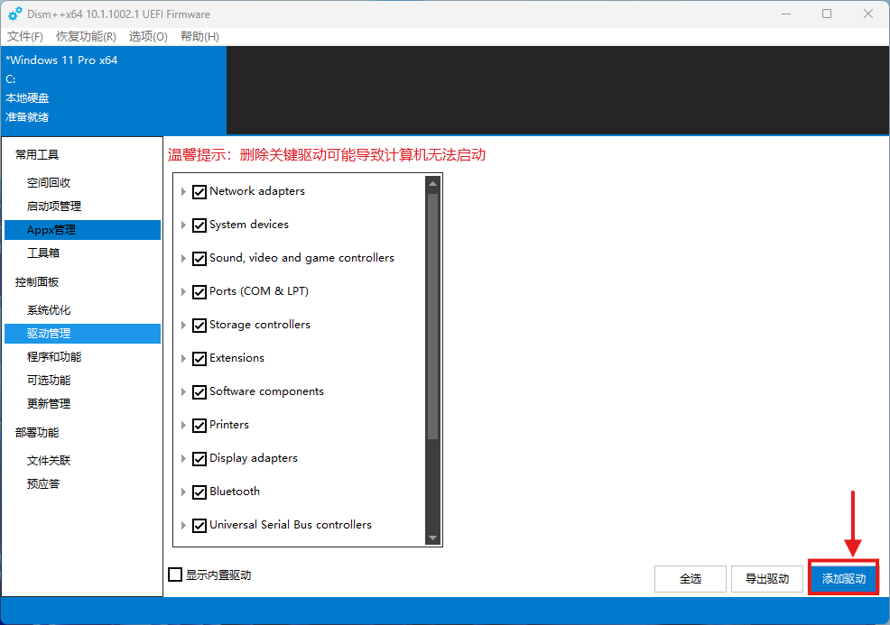
3. 如果有必要，重启。

##### 2.9 激活系统

1. 连接网络，进入设置检查激活状态：

* Windows 10：设置 - 更新和安全 - 激活
* Windows 11：设置 - 系统 - 激活 - 激活状态

2. 如果为已激活并且是数字权利激活，则激活成功。
3. 如果改变了系统版本，可能无法数字激活，此时使用正版软件服务与管理平台激活（只有专业版可以，需要连接校园网）。

   1. 运行`GP(xjtu)-x.x.x.x.exe`，安装正版软件服务与管理平台。
   2. 安装完成后，运行，根据界面指示激活。

#### 3 重置

##### 3.1 执行重置

1. 进入重置系统界面

   1. 点击 **Windows 图标**  **>** **设置图标**，选择**系统** **>** **恢复**（Windows 10 系统：选择**更新和安全** **>** **恢复**）。
      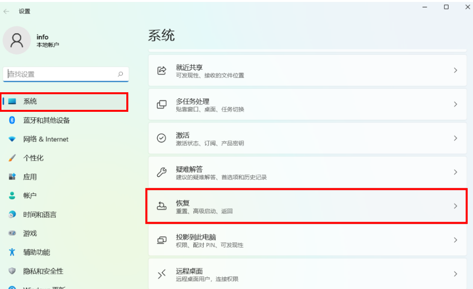
   2. 点击**重置此电脑**后面的**初始化电脑**（Windows 10 系统：点击**重置此电脑**下方的**开始**）。

      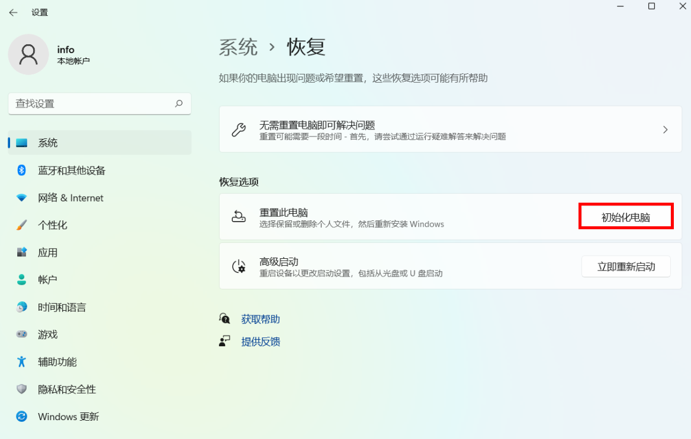
2. 进入**选择一个选项**界面，选择“**删除所有内容**”**>** “**删除系统文件**”。（注意，**务必不要**选择删除所有磁盘文件，否则肯清除机主的备份数据，建议操作前询问负责人）。

   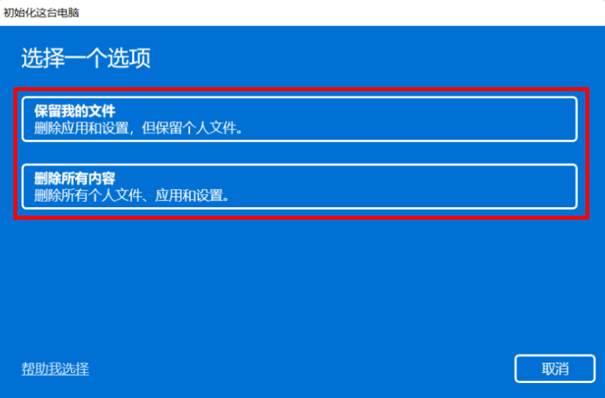
3. 选择**本地重新安装**。
4. 完成配置后，仔细检查配置正确后，点击**重置**。
